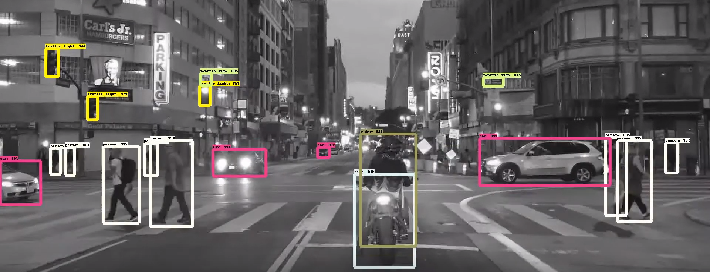

# Road-Object-Detection---BDD100K
Multi GPU training using tensorflow framework and [BDD100k database](https://bdd-data.berkeley.edu/).

BDD100K provides 2D Bounding Boxes annotated on 100,000 images for bus, traffic light, traffic sign, person, bike, truck, motor, car, train, and rider.

Model inferred on an hour long driving video can be seen by clicking below image,
[](https://youtu.be/kB-FWar58jY)

Here are a few samples from the video -> 


This readme describes every step required to get going with your own object detection classifier: 
1. BDD100k Dataset preparation
2. Model config setup
3. Training scripts
4. Freezing model

### 1. BDD100k Dataset preparation
* Download the dataset from [here](https://bdd-data.berkeley.edu/portal.html#download).
* Tensorflow object Detection api reads data in tfrecords format, convert BDD100K train and validation dataset to TFRecords.
* This can be done easily with the help of this [repo](https://github.com/meyerjo/deepdrive_dataset_tfrecord). Just follow the instructions given in the repo's readme file...
```
python3 create_tfrecord.py --fold_type train --input_path Data/BDD100k/bdd100k/images_luminance_avg/ --output_path Data/BDD100k/tf_records/tf_records_rgb_avg/
python3 create_tfrecord.py --fold_type val --input_path Data/BDD100k/bdd100k/images_luminance_avg/ --output_path BDD100k/tf_records/tf_records_rgb_avg/
```

### 2. Model config setup
* [Tensorflow Object Detection API](https://github.com/tensorflow/models/tree/master/research/object_detection) provides a collection of detection models pre-trained on the COCO dataset, the Kitti dataset, the Open Images dataset, the AVA v2.1 dataset and the iNaturalist Species Detection Dataset. These models can be useful for out-of-the-box inference if you are interested in categories already in those datasets. They are also useful for initializing your models when training on novel datasets. 
* Clone [Tensorflow Object Detection API](https://github.com/tensorflow/models.git) into your scratch drive.
* Create pbtxt file containing class dict in a folder. The label map tells the trainer what each object is by defining a mapping of class names to class ID numbers. Use a text editor to create a new file and save it as labelmap.pbtxt in the `..models/research/object_detection/training` folder. Below is a sample,
```
item {
  name: 'bus'
  id: 1
}

item {
  name: 'traffic light'
  id: 2
}

item {
  name: 'traffic sign'
  id: 3
}

item {
  name: 'person'
  id: 4
}

item {
  name: 'bike'
  id: 5
}

item {
  name: 'truck'
  id: 6
}

item {
  name: 'motor'
  id: 7
}

item {
  name: 'car'
  id: 8
}

item {
  name: 'train'
  id: 9
}

item {
  name: 'rider'
  id: 10
}

```
* Download one of high performing models and extract the tar.gz file into `models` folder in `..research/object_detection`.
* Download the config file for the model that is to be trained from [here](https://github.com/tensorflow/models/tree/master/research/object_detection/samples/configs) and paste it a folder (Folder where you want your trained model to be saved over the epochs. Example, create a folder `training_faster_rcnn_inception_resnet_v2_rgb_avg_mobileye_size` and paste the [config](https://github.com/tensorflow/models/blob/master/research/object_detection/samples/configs/mask_rcnn_inception_resnet_v2_atrous_coco.config) file) created under `..research/object_detection`.
* Now come the editing part, to edit paths and hyperparameters. Taking example of [frcnn with inception resnet v2](https://github.com/tensorflow/models/blob/master/research/object_detection/samples/configs/mask_rcnn_inception_resnet_v2_atrous_coco.config), Below are the major changes,
    1. Modify [num_classes](https://github.com/tensorflow/models/blob/984be23d3d0f7c324c230dd4014c5e5ee1359684/research/object_detection/samples/configs/mask_rcnn_inception_resnet_v2_atrous_coco.config#L10) to 10, bdd offers 10 classes.
    2. Modify [min and max dim](https://github.com/tensorflow/models/blob/984be23d3d0f7c324c230dd4014c5e5ee1359684/research/object_detection/samples/configs/mask_rcnn_inception_resnet_v2_atrous_coco.config#L13) to 992 and 1824 respectively.
    3. Modify [learning rate schedule](https://github.com/tensorflow/models/blob/984be23d3d0f7c324c230dd4014c5e5ee1359684/research/object_detection/samples/configs/mask_rcnn_inception_resnet_v2_atrous_coco.config#L113)
    4. Modify [fine_tune_checkpoint](https://github.com/tensorflow/models/blob/984be23d3d0f7c324c230dd4014c5e5ee1359684/research/object_detection/samples/configs/mask_rcnn_inception_resnet_v2_atrous_coco.config#L128) path to the ckpt path of the model that you downloaded.
    5. Modify label_map_path at line number [145](https://github.com/tensorflow/models/blob/984be23d3d0f7c324c230dd4014c5e5ee1359684/research/object_detection/samples/configs/mask_rcnn_inception_resnet_v2_atrous_coco.config#L145) and [159](https://github.com/tensorflow/models/blob/984be23d3d0f7c324c230dd4014c5e5ee1359684/research/object_detection/samples/configs/mask_rcnn_inception_resnet_v2_atrous_coco.config#L159) with the pbtxt file path containing class details.
    6. Modify input_path at line number [143](https://github.com/tensorflow/models/blob/984be23d3d0f7c324c230dd4014c5e5ee1359684/research/object_detection/samples/configs/mask_rcnn_inception_resnet_v2_atrous_coco.config#L143) and [159](https://github.com/tensorflow/models/blob/984be23d3d0f7c324c230dd4014c5e5ee1359684/research/object_detection/samples/configs/mask_rcnn_inception_resnet_v2_atrous_coco.config#L159) with `/s/mlsc/TJP/Data/BDD100k/tf_records/tf_records_rgb_avg/train.tfrecord` and `s/mlsc/TJP/Data/BDD100k/tf_records/tf_records_rgb_avg/val.tfrecord` respectively.
Play around with other hyperparameters...

### 4. Training scripts
*As of version 1.9, TensorFlow has deprecated the "train.py" file and replaced it with "model_main.py" file. I haven't been able to get model_main.py to work correctly yet (I run in to errors related to pycocotools). Fortunately, the train.py file is still available in the /object_detection/legacy folder. Simply move train.py from /object_detection/legacy into the /object_detection folder and then continue following the steps below.*
Based on the number of available GPUs, play with worker_replicas, num_clones and ps_tasks.
`python3 train.py --logtostderr --train_dir TRAIN_DIR --pipeline_config_path CONFIG_PATH --worker_replicas=8 --num_clones=8 --ps_tasks=1`

Trained models will be saved in the folder where you placed the config file.

To see the progress on tensorboard, run `tensorboard --logdir=training`

### 5. Freezing model
Now that training is complete, the last step is to generate the frozen inference graph (.pb file). From the \object_detection folder, issue the following command, where “XXXX” in “model.ckpt-XXXX” should be replaced with the highest-numbered .ckpt file in the training folder:
```
python3 export_inference_graph.py --input_type image_tensor  --pipeline_config_path training_faster_rcnn_inception_resnet_v2_rgb_avg_mobileye_size/faster_rcnn_inception_resnet_v2_atrous_coco.config --trained_checkpoint_prefix training_faster_rcnn_inception_resnet_v2_rgb_avg_mobileye_size/model.ckpt-200000 --output_directory exported_trained_graphs/faster_rcnn_inception_resnet_v2_rgb_avg_mobileye_size
```
This creates a frozen_inference_graph.pb file in the `\object_detection\exported_trained_graphs/faster_rcnn_inception_resnet_v2_rgb_avg_mobileye_size` folder. The .pb file contains the object detection classifier.

Use this model the infer on any image with the object detection pipeline...

